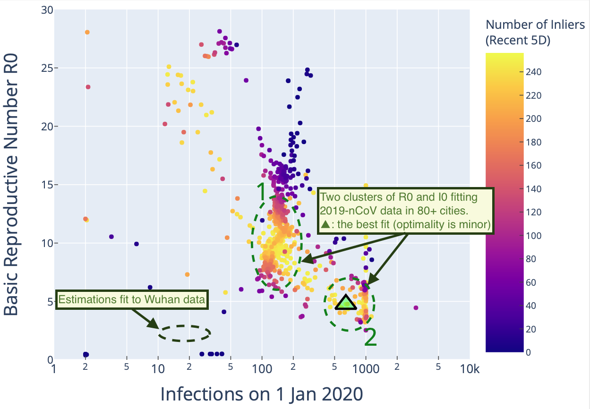

# Robust Statistical Estimation of Epidemic Transmission Models on 2019-nCoV Data


## Summary
The recent outbreak of a novel coronavirus (2019-nCoV) has quickly evolved
into a global health crisis. This project adopts robust statistical methods
to estimate key parameters of the transmission model of 2019-nCoV. 
SEIR models are fit on a group of 84 major China cities and Wuhan connected
by traffic networks of large volume immediately prior to Wuhan lockdown.
Model fitting is managed using the random sample consensus (RANSAC)
algorithm.

The robust estimation enables us to identify two clusters of transmission
models, both are of substantial concern, 

- in the initial stage, the basic reproductive number R0 may be ranging in 8 ~ 14, comparable to that of measles
- there has been a large unidentified group of infections (I0) dated back to 1 Jan 2020

Previous model estimation based on maximum likelihood can be severely biased due 
to the large volume of data reported in the initial stage in Wuhan, subject to delay/misdiagnosis.

Comparision of the estimation results from the consensus analysis and what was believed:


## Installation
All procedures are included in a singal Python Notebook, all data up-to-date
are provided in `data/` folder. Jupyter Notebook is needed to run the
project. Alternatively, this project has been made working in cloud-based 
computational environment (there is a data downloading section following
the environment preparation in the notebook). It has been tested on Colab by
Google Research, which can be setup by a single click on the "Open in Colab"
link at the top of the page displaying `NB_RANSAC_Estimation_SEIR_2019-nCoV.ipynb`.

## Application on Own/Local Data of Infections/Traffic
Such adoptation is straightforward by replacing the data files in `data/` folder.
More instructions maybe added here. 
For emergent needs, raise an issue or contact the author.

## Updates and Errata
As the project is on an on-going public health event, I choose to release the research on real time. In
 `errata_updates/` folder there are errata and updates to the arXiv article (see Reference below).

- `fig1a_with_circles.pdf` to Fig. 1a, add annotations of the parameter
clusters mentioned discussed in text body

NB: this is not updates or corrections to the project implementation, which
IS realtime on Github.

## Reference
If you use the project in your report/research, please cite the work as follows

```
@article{Li2020,
    author={Jun Li},
    title={{A Robust Stochastic Method of Estimating the Transmission Potential of 2019-nCoV}},
    journal={arXiv},
    year={2020}
}
```

Or

"""
J. Li, "A Robust Stochastic Method of Estimating the Transmission Potential of 2019-nCoV", arXiv, 2020
"""


